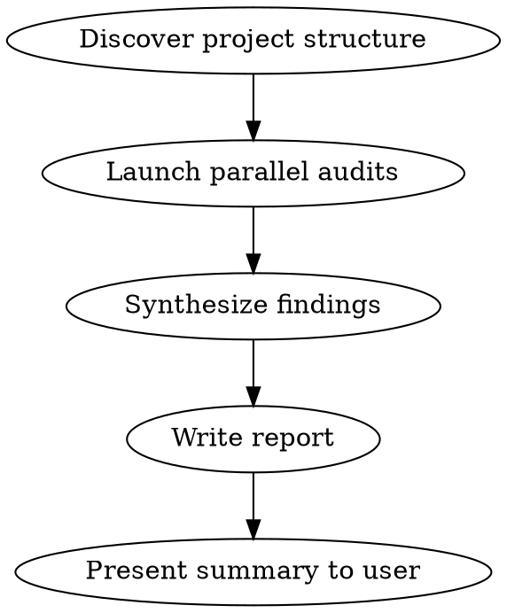

# Architecture Audit

Full codebase architecture audit that produces a categorized findings report with a prioritized action plan.

## When to Use

- Periodic codebase health check
- Before building a major feature (identify structural blockers)
- After code review flags architectural concerns
- When onboarding to an unfamiliar codebase
- When tech debt feels like it's slowing development

## Workflow



### Step 1: Discover Project Structure

Read CLAUDE.md, package.json, tsconfig, and top-level directory structure to understand:
- Framework and language (NestJS, React, Express, etc.)
- Module/package organization
- Existing conventions and patterns

### Step 2: Launch Parallel Audits

Dispatch up to 3 Explore agents in parallel, each covering 2 audit layers:

**Agent 1 — Structure & Modularity + Code Patterns:**
- Module boundaries and dependency direction (are modules importing from each other's internals?)
- Circular dependencies (`A → B → A`)
- File organization (god files >500 lines, deeply nested structures)
- DRY violations (duplicated logic across modules)
- Dead code (unused exports, unreachable branches)
- Inconsistent patterns (mixed approaches for the same concern)
- Missing or premature abstractions

**Agent 2 — Error Handling + Security:**
- Inconsistent error strategies (some throw, some return null, some swallow)
- Missing boundary validation (controller inputs, external API responses)
- Silent failures (empty catch blocks, ignored promise rejections)
- Hardcoded secrets or credentials
- Missing input sanitization (SQL injection, XSS, command injection)
- OWASP top 10 concerns relevant to the stack

**Agent 3 — Performance + Test Coverage:**
- N+1 query patterns (ORM loops without eager loading)
- Missing caching where data is read-heavy
- Unnecessary re-renders (React) or recomputation
- Bundle size concerns (large imports, missing tree-shaking)
- Untested critical paths (auth, payment, data mutations)
- Test organization issues (missing integration tests, test pollution)
- Coverage gaps in error/edge case handling

### Step 3: Synthesize Findings

Merge agent results. For each finding:
- **Severity**: `critical` (blocks correctness/security), `warning` (impacts maintainability/performance), `info` (improvement opportunity)
- **File paths**: Specific files affected
- **Recommendation**: Concrete fix, not vague advice

### Step 4: Write Report

Save to `docs/architecture-audit-YYYY-MM-DD.md` with this structure:

```markdown
# Architecture Audit — YYYY-MM-DD

## Executive Summary
[1-2 sentences: overall health and top concern]

## Critical Findings
[Security issues, correctness bugs, architectural blockers]

## Warnings
[Maintainability issues, performance concerns, pattern inconsistencies]

## Info
[Improvement opportunities, minor cleanup]

## Action Plan
[Ordered by impact-to-effort ratio, each item references specific findings above]

| Priority | Finding | Effort | Impact | Files |
|----------|---------|--------|--------|-------|
| 1        | ...     | S/M/L  | H/M/L  | ...   |
```

### Step 5: Present Summary

Show the user:
- Report file path
- Count of findings by severity
- Top 3 recommended actions

## Audit Scope Control

By default, audit the entire codebase. The user can narrow scope:
- `/architecture-audit src/modules/auth` — audit a specific module
- `/architecture-audit --focus security` — audit only one layer

Supported focus areas: `structure`, `patterns`, `errors`, `security`, `performance`, `tests`

## Common Mistakes

| Mistake | Fix |
|---------|-----|
| Reporting style preferences as findings | Only report things that affect correctness, security, maintainability, or performance |
| Vague recommendations ("improve error handling") | Be specific: "Add try/catch in `src/services/payment.ts:42` around the Stripe API call" |
| Flagging framework conventions as issues | Respect the framework's idioms (e.g., NestJS decorators, React hooks patterns) |
| Reporting too many info-level findings | Cap info findings at 10; focus on what matters |
| Ignoring existing CLAUDE.md conventions | Read project conventions first; don't flag intentional patterns as problems |
